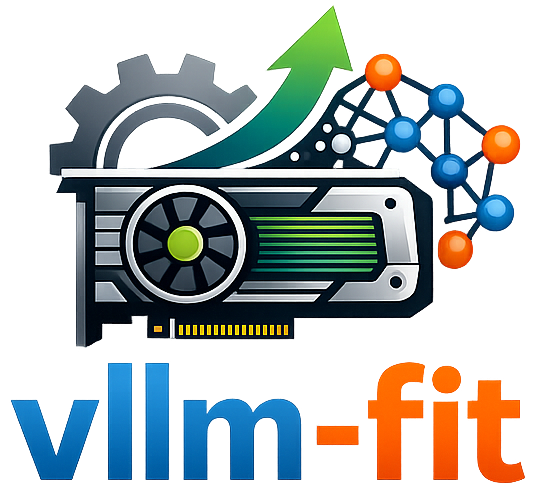

# vLLM-Fit

<p align="center">
    
</p>

A CLI tool designed to simply _recommend_ (conservative), and/or _profile_ (to maximize resource utilization) vLLM engine arguments for any HuggingFace model on the user's current hardware.

## Features

- **Static Estimation**: Instant recommendations from the model's config and exact checkpoint size (GQA, MLA, mixture-of-experts, sliding-window/hybrid attention, quantized and GGUF weights)
- **Dynamic Profiling**: Launches vLLM with candidate settings to confirm they start, shrinking only on memory failures; any other vLLM error stops profiling and is shown
- **Multi-GPU Support**: Tensor-parallel sizing that respects head divisibility and the smallest selected GPU
- **Free-memory aware**: `gpu_memory_utilization` is capped so vLLM's startup check passes even when other processes hold GPU memory
- **Apple Silicon GPU**: With the [`vllm-metal`](https://github.com/vllm-project/vllm-metal) plugin installed, sizes for the Apple GPU against Metal's working-set limit
- **CPU**: Sizes for vLLM's CPU backend when no GPU is present and emits a complete CPU serve command

## Quick Start

```bash
# Create and activate uv environment
uv venv --seed --python 3.10
source .venv/bin/activate

# Install vLLM
uv pip install vllm --torch-backend=auto

# Install vllm-fit
uv pip install git+https://github.com/jranaraki/vllm-fit
```

## Commands

### `recommend` - Quick parameter suggestions

```
vllm-fit recommend <model_id> [--gpuid <ids>] [--device auto|gpu|metal|cpu]
```

Returns estimated optimal parameters without running the model.

### `profile` - Find actual memory limits

```
vllm-fit profile <model_id> [--gpuid <ids>] [--device auto|gpu|metal|cpu] [--timeout <seconds>]
```

Launches vLLM with candidate settings to find what actually starts on your hardware.
Exits non-zero (and prints no command) if no configuration could be verified.

### `serve` - Start vLLM server

```
vllm-fit serve <model_id> [--gpuid <ids>] [--device auto|gpu|metal|cpu] [--timeout <seconds>]
```

Profiles, then starts an optimized vLLM OpenAI-compatible server.

### GPU Selection

Use `--gpuid` to control which GPUs are used:

- `--gpuid 0` - Use GPU 0 only
- `--gpuid 0,1,2` - Use GPUs 0, 1, and 2
- `--gpuid all` (default) - Use all available GPUs

GPU numbers are NVML indices (PCI bus order). If `CUDA_VISIBLE_DEVICES` is already set
(e.g. by Slurm or Kubernetes), only those GPUs are considered, and `serve`/`profile`
never launch on GPUs outside it.

### Local models

`<model_id>` can also be a local model directory (as with `vllm serve /path/to/model`);
its `config.json` and safetensors headers are read directly.

### Device and timeout

- `--device auto` (default) sizes for NVIDIA GPUs when they're visible, for the Apple
  GPU when the `vllm-metal` plugin is installed on Apple Silicon, and for vLLM's CPU
  backend when no accelerator is present. If an accelerator vllm-fit can't size is
  found (AMD/Intel/TPU, or an NVIDIA driver whose GPUs can't be queried), it stops
  with an explanation instead of silently sizing for the CPU. `--device cpu`,
  `--device gpu` or `--device metal` overrides detection.
- `--timeout` (default 900) is how long each vLLM test launch may take, including
  weight loading and compilation. A timeout is reported as inconclusive, not as
  "doesn't fit".

### Apple Silicon (vllm-metal)

On a Mac with the [`vllm-metal`](https://github.com/vllm-project/vllm-metal) plugin
installed in the same Python environment as vllm-fit, all three commands size for the
Apple GPU:

- vllm-metal gives the KV cache `--gpu-memory-utilization` × Metal's recommended
  working set (read from MLX; e.g. 37.4 GB of 48 GB unified memory) minus the weights
  and a profiled overhead, so that limit, not total RAM, is the base.
- Utilization is also capped by the unified memory free right now, since going over
  it means swapping rather than a clean failure.
- The command has no CPU-only settings and uses one GPU:

  ```
  vllm serve mlx-community/gpt-oss-20b-MXFP4-Q8 --gpu_memory_utilization 0.9 --tensor_parallel_size 1 --max_model_len 131072 --max_num_seqs 6
  ```

If vllm-fit runs in a different environment from vllm-metal, pass `--device metal`.
Without MLX, the working set is assumed to be ⅔ of RAM and a warning says so.

### CPU Mode

All three commands auto-detect your hardware. When no NVIDIA GPU is found,
vllm-fit runs in CPU mode automatically (no flag needed; `--gpuid` is ignored with a warning):

- **Conservative, RAM-aware sizing** — `max_model_len` and `max_num_seqs` are
  derived from available system RAM and deliberately leave headroom, so the machine
  stays responsive while vLLM serves rather than consuming all free memory.
- **Complete CPU command** — the emitted command drops the GPU-only flags
  (`--gpu_memory_utilization`, `--tensor_parallel_size`) and is prefixed with the
  `VLLM_CPU_KVCACHE_SPACE=<GB>` the CPU backend needs to size its KV cache:

  ```
  VLLM_CPU_KVCACHE_SPACE=14 vllm serve <model_id> --max_model_len 8192 --max_num_seqs 8 --max_num_batched_tokens 8192 --enforce-eager
  ```

- **Apple Silicon without vllm-metal** — sized for vLLM's CPU backend against the
  unified-memory pool. Native vLLM on macOS is a source build and CPU-only without the
  plugin.

## Output

### `recommend`

Running `vllm-fit recommend Qwen/Qwen3-0.6B` on an idle 4 GB GPU prints:

```
GPU VRAM: 4.0 GB

╭─────────────────────────────────────── Static Estimation ────────────────────────────────────────╮
│ Recommended Parameters                                                                           │
╰──────────────────────────────────────────────────────────────────────────────────────────────────╯
model_id: Qwen/Qwen3-0.6B
gpu_memory_utilization: 0.8
max_model_len: 4680
tensor_parallel_size: 1
max_num_seqs: 1
estimated_weights_memory_gb: 1.4

Run this command:
CUDA_DEVICE_ORDER=PCI_BUS_ID CUDA_VISIBLE_DEVICES=0 vllm serve Qwen/Qwen3-0.6B --gpu_memory_utilization 0.8 --tensor_parallel_size 1 --max_model_len 4680 --max_num_seqs 1
```

`gpu_memory_utilization` is below 0.9 here because an idle 4 GB card has ~3.7 GB free,
and vLLM refuses to start unless free memory covers `utilization × total`.
The `CUDA_*` prefix pins the command to the GPUs that were sized (NVML and CUDA
number GPUs differently unless `CUDA_DEVICE_ORDER=PCI_BUS_ID` is set).
`max_num_seqs` is the number of requests that can each use the full `max_model_len`
at the same time (see [How the estimate works](#how-the-estimate-works)).

### `profile`

`vllm-fit profile <model_id>` prints each launch it attempts, then either:

- **success**: a summary (attempts, time, whether `--enforce-eager` was needed), the
  verified parameters and the `vllm serve` command; or
- **failure**: the reason, e.g. *vLLM is not installed*, *vLLM failed for a reason
  other than memory* followed by the tail of vLLM's own log, or *no configuration
  fits in memory*, and a non-zero exit code.

## Requirements

- **vLLM** - Install separately (GPU or CPU version, see vLLM installation docs)
- **Hardware**:
  - GPU: NVIDIA GPU with CUDA support, 4GB+ VRAM recommended
  - CPU / Apple Silicon: 16GB+ (unified) RAM recommended (varies by model size)
- Python 3.10+ (vLLM's minimum; vllm-fit's own `recommend` also runs on 3.9)

## Troubleshooting

### "No usable NVIDIA GPU" / "NVIDIA driver is installed, but no GPU could be queried"

1. Check `nvidia-smi` shows your GPU. The error includes NVML's message (e.g. a
   driver/library version mismatch after an update usually needs a reboot).
2. In a container, make sure it was started with GPU access (`--gpus all`).
3. If `CUDA_VISIBLE_DEVICES` is set, make sure it names GPUs that exist.
4. To size for the CPU backend anyway, pass `--device cpu`.

### Gated models

For gated repos (e.g. `meta-llama/*`), accept the license on the model's HuggingFace
page, then set `HF_TOKEN` or run `hf auth login`.

### CPU mode not working?

1. Ensure vLLM CPU version is installed (not GPU version)
2. Check available RAM: `python -c "import psutil; print(psutil.virtual_memory().total / 1024**3)"` (need 16GB+ recommended)
3. Try a smaller model or quantized GGUF format
4. On macOS, install the `vllm-metal` plugin for Apple-GPU inference (vllm-fit then sizes
   for Metal), or build vLLM from source for the CPU backend

### Model won't fit?

Try:
- `--enforce-eager` (vllm-fit adds it automatically when it frees enough memory)
- Try a quantized model (AWQ, GPTQ, 4-bit/8-bit)
- Use a smaller model variant
- Get more GPUs for larger models

### "Downloaded GGUF files not found"

Try:
- vLLM finds a GGUF file by matching the quant tag (e.g. `Q8_0`) in its file name.
  Some older repos don't follow that convention: for example
  `Qwen/Qwen2-0.5B-Instruct-GGUF` ships `qwen2-0_5b-instruct-q8_0.gguf`, so
  `vllm serve Qwen/Qwen2-0.5B-Instruct-GGUF:Q8_0 …` fails with
  `ValueError: Downloaded GGUF files not found … for quant_type Q8_0`.
- Fix it by renaming the file in the HuggingFace cache
  (`~/.cache/huggingface/hub/models--<org>--<repo>/snapshots/<hash>/`) so the tag
  matches, e.g. `qwen2-0_5b-instruct-q8_0.gguf` → `qwen2-0_5b-instruct-Q8_0.gguf`.

## How It Works

1. **Fetches the model config** from Hugging Face (or a local directory) and the
   exact checkpoint size from its safetensors headers, without downloading weights.
2. **Detects hardware**: total and free memory per GPU via NVML, or system RAM for
   the CPU backend.
3. **Estimates** weights, activation, CUDA-graph and KV-cache memory per GPU and
   derives `gpu_memory_utilization`, `tensor_parallel_size`, `max_model_len` and
   `max_num_seqs`.
4. **Profiles** (`profile` / `serve`) by launching vLLM with those settings and
   adjusting only after memory failures.
5. **Prints the command** to run.

## How the estimate works

These are the assumptions behind `recommend`. Compare its numbers with vLLM's own
startup log (`Model loading took … GiB`, `GPU KV cache size: … tokens`) when it matters.

- **Weights** come from the checkpoint's safetensors headers when the Hub (or local
  cache) is reachable. Float32 tensors are counted at the 16-bit size vLLM serves them
  in, and multi-token-prediction layers that vLLM only loads for speculative decoding
  are excluded. GGUF models are sized from the quant tag's bits per weight. Offline, an analytic
  parameter count is used and a warning says so.
- **Max context** follows vLLM's own derivation (RoPE scaling rules for YaRN,
  LongRoPE, Llama-3 and Gemma-3).
- **Utilization** is capped at 0.90, at `total − max(0.4 GB, 5%)`, and at
  `(free − 0.5 GB) / total` on the busiest selected GPU (vLLM's startup check).
  With mixed GPUs, every GPU is sized as the smallest one.
- **Fixed overheads** per GPU: ~0.5 GB non-PyTorch memory (+0.7 GB with tensor
  parallelism), CUDA graphs `min(3, max(0.5, 10% of weights))` GB (zero with
  `--enforce-eager`), and activation memory for vLLM's default prefill batch
  (`max_num_batched_tokens` is 2048, or 8192/16384 on ≥70/≥160 GB GPUs).
- **KV cache** is 16-bit. Full-attention layers hold every token; sliding-window
  layers hold at most the window. Linear-attention / Mamba layers are treated as
  holding no per-token KV (their fixed per-request state is not counted yet).
- **`max_model_len`** is the longest context one request can use within the KV
  budget, capped by the model's limit as vLLM derives it. **`max_num_seqs`** is how
  many such full-length requests fit at once, so it can be 1 on small GPUs. vLLM
  still serves shorter requests concurrently up to that cap.
- **Apple GPU (vllm-metal)**: KV budget = utilization × Metal working set − weights −
  (0.6 GB + activation), the same layer-aware KV model as on NVIDIA. Checked against
  real vllm-metal startups: predicted KV budget within 1.2% (always below) for
  Qwen3-0.6B, Qwen3-Coder-30B-A3B 4-bit and gpt-oss-20b.
- **CPU backend**: ~20% of RAM is left for the OS, the KV cache gets at most half of
  what remains (and ≤30% of RAM), context is capped at 8192 and concurrency at 8.

### Known limitations

- Only NVIDIA GPUs, Apple GPUs via vllm-metal and vLLM's CPU backend are sized. MIG slices and pipeline
  parallelism are not modelled.
- Multimodal encoders' activation memory and fp8 KV cache are not modelled.
- Overhead constants are approximate and can drift between vLLM releases.

## Citing

If you find vllm-fit useful and are interested in citing this work, please use the following BibTex entry:

```
@software{vllmfit2026,
  author = {Javad Anaraki},
  title = {vllm-fit: Hardware-Aware vLLM Argument Recommendation and Profiling},
  url = {https://github.com/jranaraki/vllm-fit},
  version = {0.5.0},
  year = {2026},
}
```

## Acknowledgments

- [llmfit](https://github.com/AlexsJones/llmfit) for the inspiration 
